# ERD – Cosmetics Management System

Kiến trúc microservice: mỗi service sở hữu một database PostgreSQL độc lập
(tên service: `cosmetic_<domain>_service`). Các quan hệ liên service là
**logical reference** (varchar/uuid, không có FK ở mức DB); FK thật chỉ tồn tại
trong nội bộ từng service và đều dùng `ON DELETE CASCADE`.

## Sơ đồ tổng thể

```mermaid
erDiagram
    %% ============ authentication-service ============
    AUTH_USERS {
        uuid id PK
        uuid user_id UK
        varchar password
        timestamptz email_verified_at
    }

    %% ============ authorization-service ============
    ROLES {
        varchar id PK
        varchar name
    }

    %% ============ user-service ============
    USERS {
        uuid id PK
        varchar first_name
        varchar last_name
        enum gender
        varchar email UK
        varchar role_id
        boolean is_active
    }

    %% ============ department-service ============
    DEPARTMENTS {
        uuid id PK
        varchar code UK
        varchar name UK
        varchar manager_id
        boolean is_active
    }

    %% ============ employee-service ============
    EMPLOYEES {
        uuid id PK
        varchar user_id UK
        varchar code UK
        varchar department_id
        timestamptz hired_at
        enum_status status
        varchar phone
        varchar address
        enum_position position
    }

    %% ============ customer-service ============
    CUSTOMERS {
        uuid id PK
        varchar user_id UK
        varchar code UK
    }
    ADDRESSES {
        uuid id PK
        uuid customer_id FK
        varchar city
        varchar street
    }
    PHONES {
        uuid id PK
        uuid customer_id FK
        varchar phone UK
    }

    %% ============ category-service ============
    CATEGORIES {
        uuid id PK
        varchar name UK
        varchar description
        boolean is_active
    }

    %% ============ supplier-service ============
    SUPPLIERS {
        uuid id PK
        varchar code UK
        varchar name
        varchar email UK
        varchar phone
        varchar address
        boolean is_active
    }

    %% ============ cosmetic-service ============
    COSMETICS {
        uuid id PK
        varchar code UK
        varchar name
        varchar brand
        varchar origin
        varchar description
        varchar image_url
        boolean is_active
    }
    COSMETIC_VARIANTS {
        uuid id PK
        uuid cosmetic_id FK
        varchar name
        varchar color
        varchar volume
        numeric price
        numeric cost_price
        boolean is_active
    }
    COSMETIC_CATEGORIES {
        uuid id PK
        uuid cosmetic_id FK
        uuid category_id
    }

    %% ============ inventory-service ============
    INVENTORIES {
        uuid id PK
        varchar variant_id UK
        integer quantity
        date expiry_date
        timestamptz last_updated_at
    }
    STOCK_ADJUSTMENTS {
        uuid id PK
        uuid inventory_id
        varchar variant_id
        integer adjustment
        varchar reason
        varchar note
        varchar created_by
    }

    %% ============ purchase-service ============
    PURCHASE_ORDERS {
        uuid id PK
        varchar code UK
        varchar supplier_id
        enum_status status
        numeric total_amount
    }
    PURCHASE_ORDER_LINES {
        uuid id PK
        uuid purchase_order_id FK
        varchar variant_id
        integer quantity
        numeric unit_price
    }
    PURCHASE_TRANSACTIONS {
        uuid id PK
        uuid purchase_order_id FK
        varchar variant_id
        integer quantity
        numeric unit_price
        numeric subtotal
        varchar employee_id
    }

    %% ============ order-service ============
    ORDERS {
        uuid id PK
        varchar code UK
        varchar customer_id
        enum_status status
        numeric total_amount
    }
    ORDER_LINES {
        uuid id PK
        uuid order_id FK
        varchar variant_id
        integer quantity
        numeric unit_price
    }
    ORDER_TRANSACTIONS {
        uuid id PK
        uuid order_id FK
        varchar variant_id
        integer quantity
        numeric unit_price
        numeric subtotal
        varchar employee_id
    }

    %% ============ invoice-service ============
    INVOICES {
        uuid id PK
        varchar code UK
        varchar order_id UK
        varchar customer_id
        numeric total_amount
        numeric paid_amount
        enum_status status
        varchar note
    }

    %% ============ basket-service ============
    CARTS {
        uuid id PK
        varchar customer_id UK
        varchar status
        timestamptz created_at
        timestamptz updated_at
    }
    CART_ITEMS {
        uuid id PK
        uuid cart_id FK
        varchar variant_id
        integer quantity
        timestamptz created_at
        timestamptz updated_at
    }

    %% ---- FK thật (trong nội bộ service) ----
    CUSTOMERS ||--o{ ADDRESSES : "addresses"
    CUSTOMERS ||--o{ PHONES : "phones"
    COSMETICS ||--o{ COSMETIC_VARIANTS : "variants"
    COSMETICS ||--o{ COSMETIC_CATEGORIES : "categories"
    PURCHASE_ORDERS ||--o{ PURCHASE_ORDER_LINES : "lines"
    PURCHASE_ORDERS ||--o{ PURCHASE_TRANSACTIONS : "transactions"
    ORDERS ||--o{ ORDER_LINES : "lines"
    ORDERS ||--o{ ORDER_TRANSACTIONS : "transactions"
    CARTS ||--o{ CART_ITEMS : "items"

    %% ---- Logical reference (liên service, không có FK ở DB) ----
    ROLES ||--o{ USERS : "role_id (logical)"
    USERS ||--|| AUTH_USERS : "user_id (logical)"
    USERS ||--o{ EMPLOYEES : "user_id (logical)"
    USERS ||--o{ CUSTOMERS : "user_id (logical)"
    DEPARTMENTS ||--o{ EMPLOYEES : "department_id (logical)"
    SUPPLIERS ||--o{ PURCHASE_ORDERS : "supplier_id (logical)"
    CATEGORIES ||--o{ COSMETIC_CATEGORIES : "category_id (logical)"
    COSMETIC_VARIANTS ||--o{ INVENTORIES : "variant_id (logical)"
    COSMETIC_VARIANTS ||--o{ PURCHASE_ORDER_LINES : "variant_id (logical)"
    COSMETIC_VARIANTS ||--o{ ORDER_LINES : "variant_id (logical)"
    COSMETIC_VARIANTS ||--o{ CART_ITEMS : "variant_id (logical)"
    CUSTOMERS ||--o{ ORDERS : "customer_id (logical)"
    CUSTOMERS ||--o{ CARTS : "customer_id (logical)"
    ORDERS ||--|| INVOICES : "order_id (logical)"
```

## Chú thích

- **FK thật** (có ràng buộc khóa ngoại PostgreSQL, đều `ON DELETE CASCADE`):
  quan hệ trong nội bộ từng service (parts trên).
- **Logical reference**: cột liên service (varchar/uuid), không có ràng buộc ở
  mức DB; tính toàn vẹn được đảm bảo ở tầng ứng dụng/gateway.
- **UNIQUE một cột**: `carts.customer_id`, `employees.user_id/code`,
  `suppliers.code/email`, `purchase_orders.code`, `users.email`,
  `departments.code/name`, `invoices.code/order_id`, `auth_users.user_id`,
  `customers.user_id/code`, `categories.name`, `cosmetics.code`,
  `inventories.variant_id`, `phones.phone`, `orders.code`.
- **Enum (native PG)**: `users.gender` (male/female/other),
  `employees.status` (ACTIVE/INACTIVE/ON_LEAVE/TERMINATED),
  `employees.position` (staff/manager),
  `orders.status` & `purchase_orders.status` (PENDING/COMPLETED/CANCELLED),
  `invoices.status` (UNPAID/PARTIAL/PAID);
  riêng `carts.status` là varchar (OPEN/CHECKED_OUT).